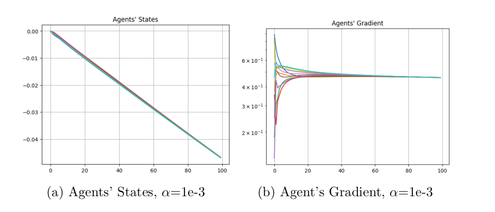
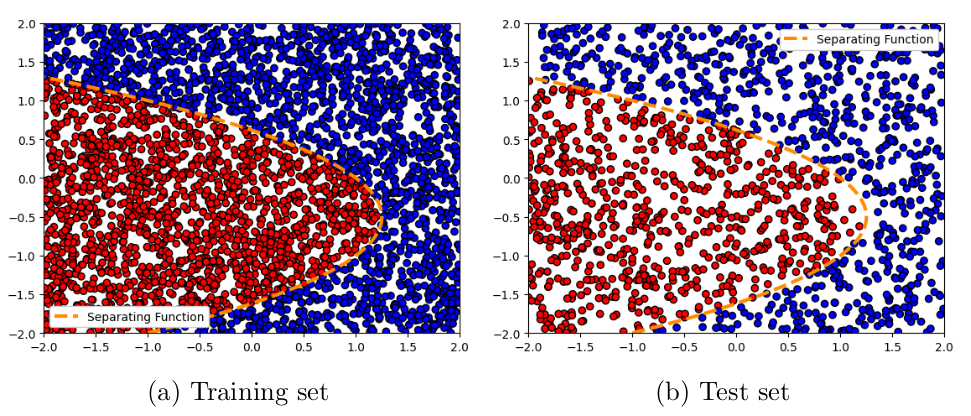

# Distributed Classification via Logistic Regression with Gradient Tracking

[](https://www.python.org/)  
Decentralized machine learning algorithm for logistic regression using Gradient Tracking across a network of agents.

---
## 📌 Project Info
- 🎓 Course: Distributed Autonomous Systems
- 🏫 University of Bologna
- 📅 Year: 2025
---

## 🧠 About the Project

This project implements a **distributed classification** system using **Gradient Tracking (GT)** in a multi-agent framework. It is divided into three main parts:

- 🔄 **Distributed Optimization** — Solving a quadratic consensus problem using Gradient Tracking.
- 🧮 **Centralized Classification** — Logistic regression via gradient descent on synthetic data.
- 🛰 **Distributed Classification** — Classifying data distributed across agents using Gradient Tracking.

Implemented in a fully interactive **Jupyter Notebook**, this project demonstrates the real-world applicability of decentralized learning algorithms for nonlinear classification tasks.
---

## 🗂 Project Structure

```
📦 distributed-logreg/
├ 📓 DAS_Task1_Group3.ipynb                  # Jupyter Notebook
├ 📄 Task1.pdf                               # Notebook execution PDF
├ 📘 report_group_03.pdf                     # Full project report (pages 7–18 relevant)
┣ 📁 images                                  # Folder for images
┃ ┣ 📸 task1_1.png                           # Plot of Distributed Optimization
┃ ┣ 📸 task1_2.png                           # Plot of Centralized Classification
┣ ┣ 📸 task1_3.png                           # Plot of Distributed Classification
├ 📄 README.md                               # You are here!
```                                                 
## ⚙️ How to Run

1. Move into the task folder:

```
$ cd Task1/
$ jupyter notebook
```

2. Open the notebook `DAS_Task1_Group3.ipynb` and run each section sequentially.

## 🧪 Tasks Breakdown

### 🚀 Task 1.1 – Distributed Optimization

- Implements Gradient Tracking on a network of agents solving a decentralized quadratic optimization problem.
- Agents reach consensus using a doubly-stochastic weighted graph.
- Test different topologies: cycle, path, star.
- Plots include agents' states, gradient norms, and cost convergence.



### 🧠 Task 1.2 – Centralized Classification

- Generate 2D datasets labeled by nonlinear conic functions (e.g., ellipse, parabola).
- Apply centralized Gradient Descent for logistic regression.
- Evaluate classification on train/test sets and compute key metrics.



### 🌐 Task 1.3 – Distributed Classification

- Extend Task 1.1 and 1.2 to a fully distributed setting.
- Split data among agents with or without label noise.
- Use GT to minimize logistic loss collaboratively.
- Visualize decision boundaries and metric evolution.
- Classify with and without label noise and compare results.


## 📊 Output & Evaluation

- 📉 Plots: Cost evolution, gradient norms, decision boundaries.
- 📋 Metrics: Classification error, accuracy, precision, recall, F1-score (train & test).
- ✅ Distributed version matches centralized accuracy with small performance drop under noise.

## 📎 Resources

- [📘 Full Report (PDF)](./report_group_03.pdf)
- [📄 Notebook Output (PDF)](./Task1.pdf)

## 👨‍🎓 Authors

Group 3 – MSc Automation Engineering, University of Bologna

- Andrea Perna
- Gianluca Di Mauro
- Meisam Tavakoli

📧 and.perna99@gmail.com

## 👩‍🏫 Supervisors

- Prof. Giuseppe Notarstefano
- Prof. Ivano Notarnicola
- Dr. Lorenzo Pichierri

## 📜 License

All rights reserved. Educational use only.
